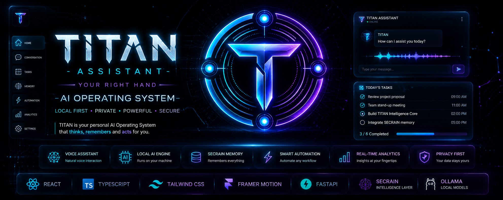
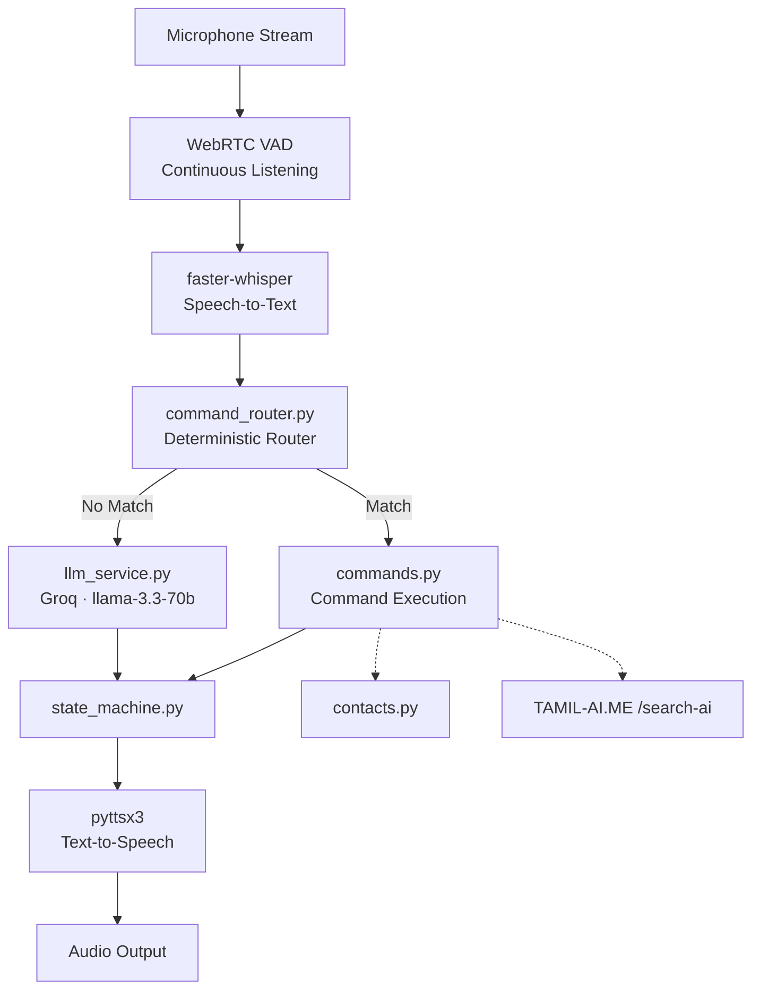
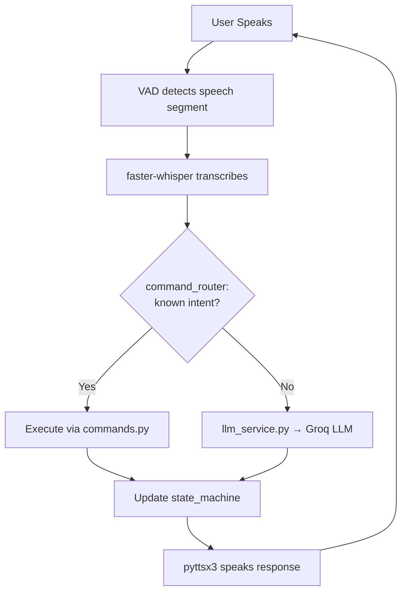

# Project-Assistant


# 🤖 Assistant

**Your Voice-First Local Companion**
Offline-Capable Voice Assistant with Deterministic Command Routing + LLM Fallback

[](#)
[](#)
[](#)
[](#)
[](#)

---

> **Assistant** (formerly **JARVIS**) is a voice-first personal assistant that
> listens continuously, resolves commands deterministically before ever
> touching an LLM, and only falls back to cloud reasoning when it genuinely
> needs to. Rewritten from the ground up in July 2026 for a flat, low-latency
> architecture.

---

## 🌟 Vision

Assistant is being built as the **voice interface layer** for Ajeem's wider
AI ecosystem — a single spoken entry point that can trigger apps, media,
messaging, and eventually Tamil-language intelligence (via **TAMIL-AI.ME**)
without round-tripping every request through an LLM.

## 🎯 Purpose

- Respond to voice with minimal latency — deterministic commands first, LLM only as fallback
- Stay useful with or without connectivity for core command paths
- Keep the codebase flat and inspectable — no framework overhead
- Serve as the spoken front door to other local/cloud AI services (TAMIL-AI.ME, Spotify, WhatsApp)

## 🏗 Architecture



**Design principle:** every utterance hits the deterministic router *before*
it's allowed to reach the LLM. This keeps common actions (open app, play
song, message a contact) fast, cheap, and offline-tolerant — the LLM is
reserved for genuinely open-ended requests.

## 🔄 Workflow



## 📁 Current Repository

```
Project-Assistant/
├── assistant_core.py      # Entry point — orchestrates the listen→respond loop
├── command_router.py      # Deterministic intent matching before LLM fallback
├── commands.py            # Concrete command implementations
├── llm_service.py         # Groq (llama-3.3-70b) fallback reasoning
├── stt_service.py         # faster-whisper speech-to-text
├── state_machine.py       # Conversation/session state
├── contacts.py            # Contact resolution for messaging commands
└── README.md
```

*Flat file structure by design — no premature package/module layering until
the assistant's scope actually demands it.*

## ✅ Current Features

- Continuous listening via WebRTC VAD (no wake-word gating)
- Local speech-to-text with faster-whisper
- Deterministic command routing before any LLM call
- LLM fallback via Groq (llama-3.3-70b) for open-ended queries
- pyttsx3 text-to-speech output
- Contact-aware command resolution (`contacts.py`)

## 🚧 In Progress / Planned

- Fix pyttsx3 / SAPI5 listening-state freeze
- YouTube search command routing
- Spotify integration via URI scheme
- WhatsApp messaging via `pywhatkit` + `contacts.py`
- Generic app-launching commands
- `tamil_query` intent → **TAMIL-AI.ME** `/search-ai` endpoint integration
- State machine actually gating logic (currently advisory, not enforced)
- Cross-turn memory (currently stateless between turns)

## ▶ Run

```bash
git clone https://github.com/ajeemsuban060-glitch/Project-Assistant
cd Project-Assistant
pip install -r requirements.txt

# Set your Groq API key
export GROQ_API_KEY=your_key_here   # or set in .env

python assistant_core.py
```

## 🤝 Contributing

Fork → Branch → Commit → Pull Request

## 📜 License

MIT

---

**Assistant** aims to become the always-listening, low-latency voice layer
that ties Ajeem's local and cloud AI systems — including **TAMIL-AI.ME** —
into one spoken interface.

=======


